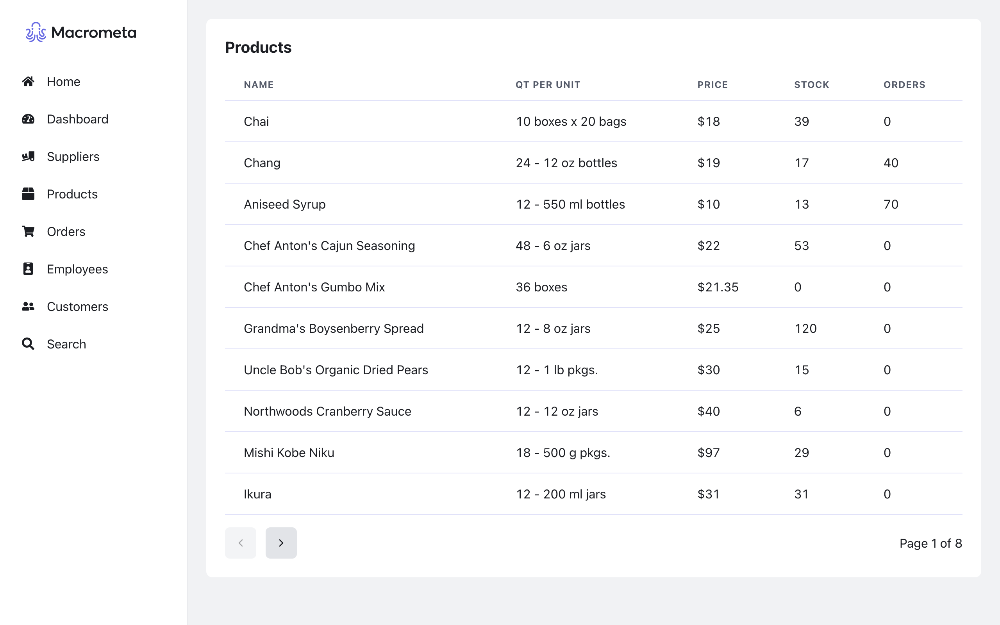

# Northwind Traders

:sparkles: Live Demo: https://macrometacorp.github.io/demo-northwind-traders/

## Overview

This is a demo of the Northwind Traders dataset, running on Macrometa.



## More Info

Macrometa resources were created in:  
**Federation**: `play.macrometa.io`  
**Fabric**: `_system`

## Run it Locally

### Prerequisites

You will have to had Node.js 18 (or later) installed in your system. Run the following command in your CLI to check your Node.js version.

```
node -v
```

### Steps

1. Open a CLI and run the command below to clone this repository. You can do:

```
git clone https://github.com/Macrometacorp/demo-northwind-traders.git
```

or

```
git clone git@github.com:Macrometacorp/demo-northwind-traders.git
```

depending on your GitHub authentication method.

2. Change directory to your new project with:

```
cd demo-northwind-traders
```

3. Create a new `.env.local` file and add your environment variables there.  
Here is how `.env.local` file should look like:

```
REACT_APP_BASE_URL=https://play.paas.macrometa.io/
REACT_APP_FABRIC_NAME=my_fabric
REACT_APP_API_KEY=...
```

**Note**: `.env.sample` is only a sample file that you can also use as a guide.

4. Install the project dependencies with:

```
npm install
```

5. Run:

```
npm start
```

to start a local development server on `http://localhost:3000`
This will run the app in the development mode. You can open [http://localhost:3000](http://localhost:3000) to view it in the browser.
Home page will be loaded automatically. If not, you can manually open it by clicking on the link in the CLI.
To see product data, you can click on the `Products` link in the navigation bar. Since that page is protected, you will be redirected to the login page.
To login, you can use your Macrometa credentials. If you don't have one, you can create a free account [here](https://play.macrometa.io/signup).


### Adding Data to Platform
If you navigate to the products page and find no data available, don't worry. 
To add data, simply go to the `demo-northwind-traders/ExtraFiles/TestData` folder where you will find three files: `categories.json`, `products.json`, and `suppliers.json`. 
Using the Macrometa console, you can easily import this data into the document store collections.

### Adding Query Workers
In `demo-northwind-traders/ExtraFiles/TestData` folder you will find ImportQueryWorkers.json file. You can use this file to import the query workers to the platform.
You can use the Macrometa console to import the Query Workers to the document store collections.