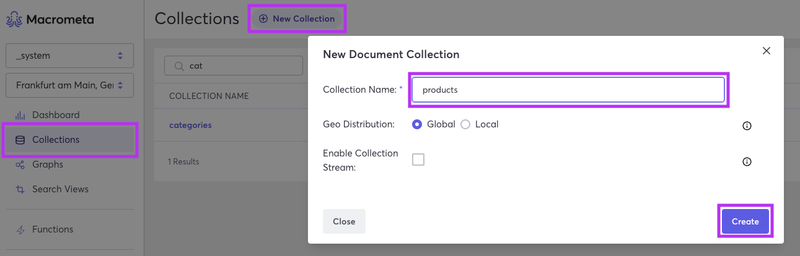
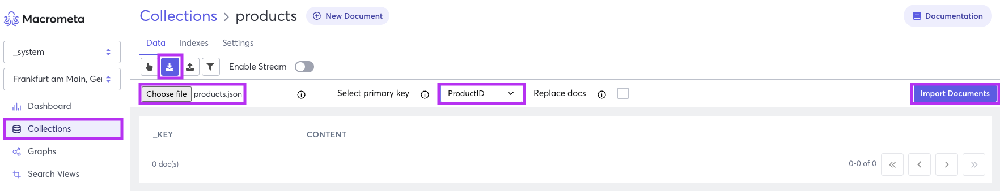
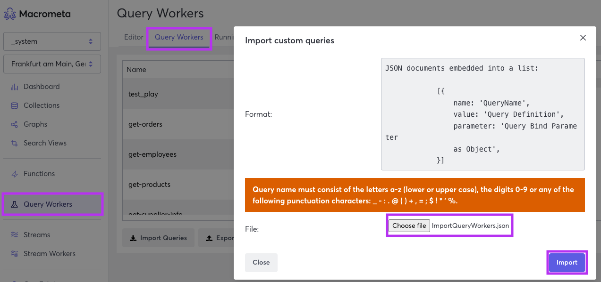
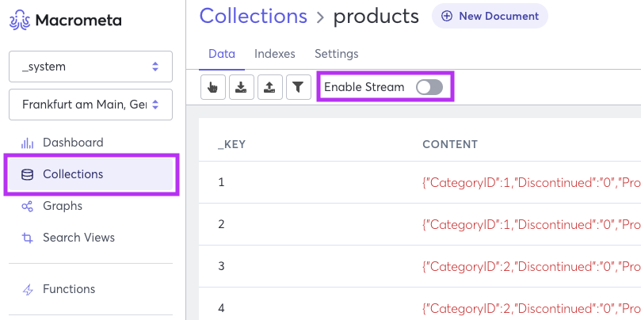

# ✨ Northwind Traders Demo ✨

## 👀 Overview

For decades, the Northwind Traders Access database has been celebrated as a prime illustration of a thorough sales database. 
Originally included with the Microsoft Office suite in 1997, it has remained a valuable source of sample data. 
Our demo application takes this iconic dataset to the next level by showcasing how it can be efficiently distributed across over **175 locations** around the globe using the innovative architecture of **Macrometa PaaS**. 
With our user-friendly, self-serve platform, you can experience firsthand the impressive potential that this cutting-edge technology unlocks for your own applications.

## ❓ How to use this demo

In this demo, you will be creating a document collection, inserting and querying some user data, and finally creating a fully operational API via Query Workers. 
This tutorial is Macrometa's version of "Hello, world!", is simplistic by design, and demonstrates how you can quickly use our stateful serverless back-end to run a globally distributed database with local read-write latencies around 50ms.

We have three parts to this demo, all the parts can be found in the `demo-northwind-traders/code` folder.
Code folder is divided into three parts:
1. **1-starting-project**
2. **2-adding-search**
3. **3-finished-project**

You also find `/slides` folders which contains detailed step-by-step guide on how to build the demo application.

`/extraFiles` contains test data and query workers that you can use to import to the platform.

The best way to use this demo is to follow the steps in the slides or README.md and then use the code in the `1-starting-project` folder to start building the application.
Any time you can skipp that step and use the code in the `2-adding-search` or `3-finished-project` folder to see the final result.

### Section `1-starting-project`
In this part of the demo we want to show how easy it is to build a application using Macrometa PaaS.
We will start with a simple React application and add the necessary code to connect to the platform and fetch data from the document store.
Goal of this part is to show how easy it is to build backend for your application writing a couple of queries and using the platform console.

### Section `2-adding-search`
In this part of the demo we want to show how easy it is to add search to your application.
Application we are building is a simple e-commerce application. Any e-commerce application needs to have a search functionality.
We are dealing with a large amount of data, and we want to make sure that our search is fast and efficient.
With just a couple of search views and a couple of lines of code we can add search to our application.

### Section `3-finished-project`
This last section is fully functional application that you can use to see how the application works.

## 🚀 Run it Locally

### Prerequisites

1. Create a free [Macrometa account](https://auth-play.macrometa.io/sign-up)
2. You will have to have **Node.js 18 (or later)** installed in your system. Run the following command in your CLI to check your Node.js version.

```
node -v
```

### Steps

1. Open a CLI and run the command below to clone this repository. You can do:

```
git clone https://github.com/Macrometacorp/demo-northwind-traders.git
```

or

```
git clone git@github.com:Macrometacorp/demo-northwind-traders.git
```

depending on your GitHub authentication method.

2. Please choose your preferred starting point from one of the following sections:


- **1-starting-project**
- **2-adding-search**
- **3-finished-project**

Change directory to your selected project with:

```
cd demo-northwind-traders/code/<your-project>
```

We recomend that you start with the `1-starting-project` folder and follow the steps in the slides or README.md to build the application.

```
cd demo-northwind-traders/code/1-starting-project
```

3. Create a new `.env.local` file and add your environment variables on your selected path.  
Here is how `.env.local` file should look like:

```
REACT_APP_BASE_URL=https://play.paas.macrometa.io/
REACT_APP_FABRIC_NAME=<your-fabric-name> (default: _system)
REACT_APP_API_KEY=<your-api-key>
```

**Note**: `.env.sample` is only a sample file that you can also use as a guide.

4. Install the project dependencies with:

```
npm install
```

5. Run:

```
npm run start
```

to start a local development server on `http://localhost:3000`
This will run the app in the development mode. You can open [http://localhost:3000](http://localhost:3000) to view it in the browser.


Home page will be loaded automatically. If not, you can manually open it by clicking on the link in the CLI.
To see product data, you can click on the `Products` link in the navigation bar. Since that page is protected, you will be redirected to the login page.
To login, you can use your Macrometa credentials. If you don't have one, you can create a free account [here](https://play.macrometa.io/signup).

## 📝 Adding Data to Macrometa Platform
If you navigate to the products page and find no data available, don't worry. 
To add data, simply go to the `demo-northwind-traders/extraFiles/TestData` folder where you will find three files: `categories.json`, `products.json`, and `suppliers.json`. 
Using the Macrometa console, you can easily import this data into the document store collections.

1. Create a new document collection called `products` on the platform.
A collection is a group of documents with a unique name and identifier. For the products, you will create a document collection that contains product information.

    1. On the side menu, click `Collections`.
    2. Click `New Collection`.
    3. Click `Document Store`.
    4. In Collection Name, enter products.
    5. Click `Create`.



2. Import the data from the `products.json` file into the `products` collection.
    1. On the side menu, click `Collections`.
    2. Select`products` collection.
    3. Click `Import documents from JSON file`.
    4. Click `Choose file`.
    5. Select the `products.json` file.
    6. Before you confirm make sure you select `ProductID` as the key
    7. Click `Import`.



After those two steps you should have data in your document store collection.
Small sample of the data is shown below:
```json
[{"ProductID": 1, "ProductName": "Chai", "SupplierID": 1, "CategoryID": 1, "QuantityPerUnit": "10 boxes x 20 bags", "UnitPrice": 18, "UnitsInStock": 39, "UnitsOnOrder": 0, "ReorderLevel": 10, "Discontinued": "0"},
 {"ProductID": 2, "ProductName": "Chang", "SupplierID": 1, "CategoryID": 1, "QuantityPerUnit": "24 - 12 oz bottles", "UnitPrice": 19, "UnitsInStock": 17, "UnitsOnOrder": 40, "ReorderLevel": 25, "Discontinued": "0"},
 {"ProductID": 3, "ProductName": "Aniseed Syrup", "SupplierID": 1, "CategoryID": 2, "QuantityPerUnit": "12 - 550 ml bottles", "UnitPrice": 10, "UnitsInStock": 13, "UnitsOnOrder": 70, "ReorderLevel": 25, "Discontinued": "0"},
 {"ProductID": 4, "ProductName": "Chef Anton's Cajun Seasoning", "SupplierID": 2, "CategoryID": 2, "QuantityPerUnit": "48 - 6 oz jars", "UnitPrice": 22, "UnitsInStock": 53, "UnitsOnOrder": 0, "ReorderLevel": 0, "Discontinued": "0"},
 {"ProductID": 5, "ProductName": "Chef Anton's Gumbo Mix", "SupplierID": 2, "CategoryID": 2, "QuantityPerUnit": "36 boxes", "UnitPrice": 21.35, "UnitsInStock": 0, "UnitsOnOrder": 0, "ReorderLevel": 0, "Discontinued": "1"},
 {"ProductID": 6, "ProductName": "Grandma's Boysenberry Spread", "SupplierID": 3, "CategoryID": 2, "QuantityPerUnit": "12 - 8 oz jars", "UnitPrice": 25, "UnitsInStock": 120, "UnitsOnOrder": 0, "ReorderLevel": 25, "Discontinued": "0"},
 {"ProductID": 7, "ProductName": "Uncle Bob's Organic Dried Pears", "SupplierID": 3, "CategoryID": 7, "QuantityPerUnit": "12 - 1 lb pkgs.", "UnitPrice": 30, "UnitsInStock": 15, "UnitsOnOrder": 0, "ReorderLevel": 10, "Discontinued": "0"},
 {"ProductID": 8, "ProductName": "Northwoods Cranberry Sauce", "SupplierID": 3, "CategoryID": 2, "QuantityPerUnit": "12 - 12 oz jars", "UnitPrice": 40, "UnitsInStock": 6, "UnitsOnOrder": 0, "ReorderLevel": 0, "Discontinued": "0"},
 {"ProductID": 9, "ProductName": "Mishi Kobe Niku", "SupplierID": 4, "CategoryID": 6, "QuantityPerUnit": "18 - 500 g pkgs.", "UnitPrice": 97, "UnitsInStock": 29, "UnitsOnOrder": 0, "ReorderLevel": 0, "Discontinued": "1"}]
```

3. Repeat the same steps for the `categories.json` and `suppliers.json` files. (They contain smaller amount of data and are not shown here.)


## 👷‍♀️👷Adding Query Workers
In `demo-northwind-traders/ExtraFiles/TestData` folder you will find ImportQueryWorkers.json file. You can use this file to import the query workers to the platform.
You can use the Macrometa console to import the Query Workers to the document store collections.

1. On the side menu, click `Query Workers`.
2. Select `Query Workers` tab.
3. Click `Chose file`.
4. Select the `ImportQueryWorkers.json` file.
5. Click `Import`.



After the import is complete, you should see the query workers in the list. You can test Query Workers by selecting action `run` from actions menu.
In the slides for this demo, you can find out how to create query workers by yourself.

## 📡 Enabling Stream on the Collection
At Macrometa every collection is a stream and every stream is a collection.
To enable stream on the collection, you can use the Macrometa console:

1. On the side menu, click `Collections`.
2. Select `products` collection.
3. Click `Enable Stream` button.



On the frontend side we will use webhooks to subscribe to the stream and receive the data:
```javascript
const establishStreamConsumerConnection = async () => {
        try {
            const otpConsumer = await fetch(`${ctx.baseUrl}/apid/otp`, {
                method: "POST",
                headers: {
                    Authorization: `bearer ${ctx.token}`,
                    accept: "application/json",
                },
            });
            const otp = await otpConsumer.json();
            const consumerUrl = `wss://${ctx.baseUrl.replace(
                "https://",
                "",
            )}/_ws/ws/v2/reader/persistent/${ctx.email.replace(
                "@",
                "_",
            )}/c8local._system/products?otp=${otp.otp}`;
            const consumer = new WebSocket(consumerUrl);
            consumer.onmessage = (event) => {
                // It is possible to get payload and messageId from the event.data
                //const { payload, messageId } = JSON.parse(event.data);
                setProductsListChange(true);
                if (!toast.isActive(changeToastId)) {
                    toast({
                        id: changeToastId,
                        title: "Products list updated.",
                        position: "top-right",
                        status: "success",
                        duration: 9000,
                        isClosable: true,
                    });
                }
            };
        } catch (error) {
            console.error("error", error);
        }
    };
```

## 🆘 Macrometa Support
If you have any trouble or need help while using demo contact [product@macrometa.com](mailto:support@macrometa.com).

## 📜 License
This demo is distributed under the MIT license found in the [LICENSE](LICENSE.md) file.